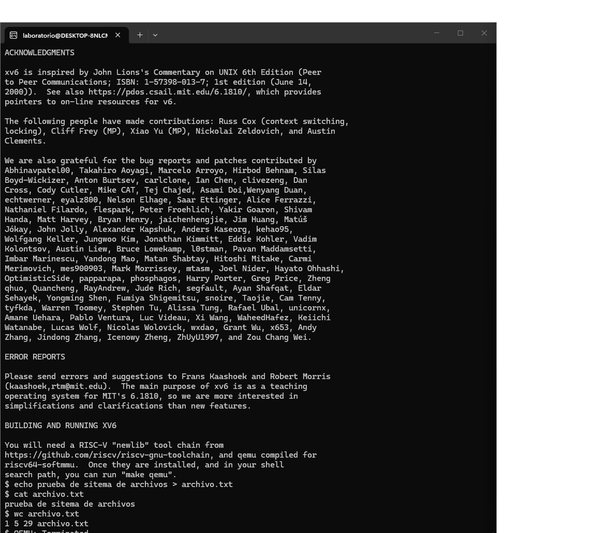

# Laboratorio 02 - xv6
- Comandos ls, echo y mkdir ejecutados en xv6

## Parte C: Análisis de llamadas al sistema

Se utilizó `grep` para localizar las llamadas al sistema en el código fuente del kernel:

- **fork:** Interfaz `SYS_fork` en `kernel/syscall.h`, implementación `sys_fork` en `kernel/sysproc.c`
- **read:** Interfaz `SYS_read` en `kernel/syscall.h`, implementación `sys_read` en `kernel/sysfile.c`

### Respuesta a la pregunta de reflexión:
La interfaz (`SYS_read`) es solo un identificador entero usado por el proceso en espacio de usuario, mientras que la implementación (`sys_read`) ejecuta la lógica real en modo kernel.
